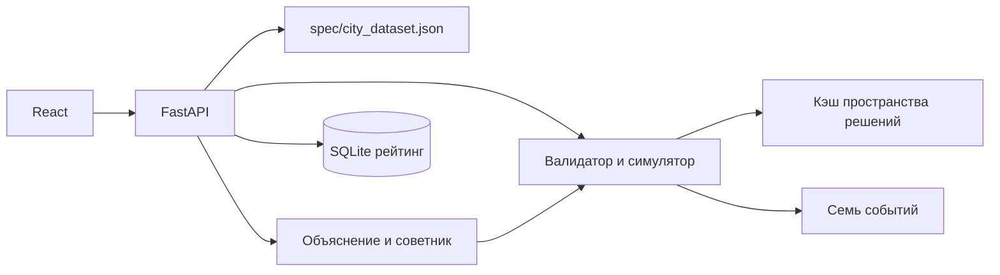

# Аким на 5 часов

Симулятор управления условной Астаной. Команда получает бюджет 100 единиц, выбирает ровно пять мер и видит, как меняются показатели пяти районов. Все команды начинают с одинаковых синтетических данных. Числа рассчитывает детерминированный движок; ИИ только объясняет проверенные результаты и предлагает варианты, которые заново проверяет движок.

## Запуск одной командой

Нужен Docker с Compose. Из корня репозитория:

```bash
docker compose up --build
```

Откройте [интерфейс](http://localhost:8501). API доступен на `http://localhost:8000/api/health`. Ключ ИИ не нужен: без него объяснение и советник работают по детерминированным шаблонам.

## Локальный запуск

Нужны Python 3.11+ и Node.js 20+. В корне репозитория:

```bash
python3 -m venv .venv
.venv/bin/pip install -r backend/requirements.txt
npm ci --prefix frontend
python spec/reference_scoring.py
.venv/bin/python -m pytest -q
```

Запустите в двух терминалах:

```bash
cd backend
../.venv/bin/uvicorn app.main:app --reload --port 8000
```

```bash
npm run dev --prefix frontend -- --host 127.0.0.1 --port 8501
```

Откройте `http://localhost:8501`. Если нужен живой LLM, скопируйте `.env.example` в `.env` и задайте `LLM_API_KEY`, `LLM_BASE_URL`, `LLM_MODEL`. `.env` игнорируется Git. Подходит любой совместимый с OpenAI Chat Completions API провайдер.

## Основной сценарий

1. Укажите название команды и откройте сведения о районах и исходных показателях.
2. Выберите пять разных мер. Недоступные из-за бюджета, направления или несовместимости варианты заблокированы. Для районной меры укажите район.
3. Отправьте план. Панель результата покажет балл, место среди допустимых планов, разрыв до лучшего, изменения по районам и критические показатели.
4. Запросите проверенное объяснение и советника. Стресс-тест показывает последствия семи отдельных событий и стоимость реакции из остатка бюджета. Рейтинг сравнивает команды по баллу или устойчивости.

Скриншоты для презентации команды: добавьте кадры каталога, плана и результата после финального оформления интерфейса.

## Архитектура



`spec/city_dataset.json` — единственный источник правил, районов, мер, весов, синергий и событий. `spec/test_cases.json` содержит 19 ответов для проверок, но приложение его не читает. `spec/reference_scoring.py` — независимый эталон расчёта. Файлы в `spec/` не меняются приложением.

### Формула

Эффект меры действует на один район или весь город с долей `(8 − лаг) / 8`; синергии добавляются без лага. Затем каждый показатель ограничивается интервалом 0–100. Балл района — взвешенная сумма десяти показателей.

```text
D_avg = Σ(доля населения района × балл района)
N_crit = число показателей районов строго ниже 40
Score = 0.7 × D_avg + 0.3 × min(балл района) − N_crit
```

Общий городской результат получает вес 70%, слабейший район — 30%; критические провалы штрафуются отдельно. Неиспользованный бюджет не повышает основной Score. Базовый план без мер имеет **52.56**. Пример из датасета (M7, M8, M10 в Нуре; M12 для города; M5 в Сарыарке) стоит 95 и даёт **56.54**.

### Проверяемый ИИ

Движок формирует таблицу фактов с итоговым баллом, расходами, показателями и натуральными единицами. LLM возвращает только ссылки вида `{{score}}` или `{{district.nura.S1.raw_after}}`; сервер подставляет значения. Неизвестные ссылки и написанные моделью числа отклоняются, после повтора включается шаблон. Советник использует до шести вызовов `validate`/`simulate`; итоговый план сервер пересчитывает сам. Без ключа используется проверенный перебор одного изменения.

### Рейтинг и события

Полный перебор даёт **694 395** допустимых планов. Отсортированные оценки хранятся в кэше с хешем датасета; при изменении датасета кэш перестраивается. Перцентиль — доля планов со строго меньшим баллом. Место — единица плюс число планов со строго большим баллом. Оптимум и разрыв к нему возвращаются только после отправки плана.

Стресс-тест рассчитывает каждое из семи событий отдельно. Защита от выбранных мер и купленная из оставшегося бюджета реакция уменьшают урон. События дают отдельный балл устойчивости и никогда не меняют официальный Score.

## API

| Метод | Адрес | Назначение |
| --- | --- | --- |
| GET | `/api/state` | Правила, каталог, районы, события и базовый балл |
| POST | `/api/validate` | Первая ошибка плана, стоимость и остаток |
| POST | `/api/simulate` | Предпросмотр без рейтинга и оптимума |
| POST | `/api/submit` | Результат, место, разрыв, лучшее одно изменение; запись команды |
| POST | `/api/explain` | Проверенное объяснение |
| POST | `/api/advise` | Проверенные варианты и след советника |
| POST | `/api/stress-test` | Семь событий и устойчивость |
| GET | `/api/leaderboard` | Команды и их баллы |
| GET | `/api/health` | Состояние, режим ИИ, хеш данных |

План передаётся как `{"plan":[{"measure":"M7","district":"nura"}, ...]}`. Неверный план в расчётных маршрутах получает HTTP 422 и `{error_code, error}`.

## Проверка по критериям жюри

| Критерий | Реализация и проверка |
| --- | --- |
| Соответствие задаче и работоспособность | Пять решений, бюджет и балл; `test_golden.py`, `test_rules.py` |
| Техническая реализация | Детерминированный движок, серверная проверка, ИИ с фактами; `test_parity.py`, `test_ai.py` |
| README и воспроизводимость | Команды запуска выше, Docker Compose, эталон и тесты |
| Ценность и применимость | Районные и натуральные показатели, баланс слабого района, события; `test_events.py` |
| Потенциал и оригинальность | Ранг среди всех планов, проверенный советник и устойчивость; `test_space.py` |

## Ограничения

Все данные синтетические: баллы, реальные единицы и события служат для учебной симуляции, а не для реального бюджета города. Модель статическая и не прогнозирует поведение жителей или изменение экономики. Рейтинг хранится локально в SQLite без учётных записей; для публичного конкурса понадобятся аутентификация и правила доступа. Скриншоты презентации команда добавляет после окончательной настройки внешнего вида.
