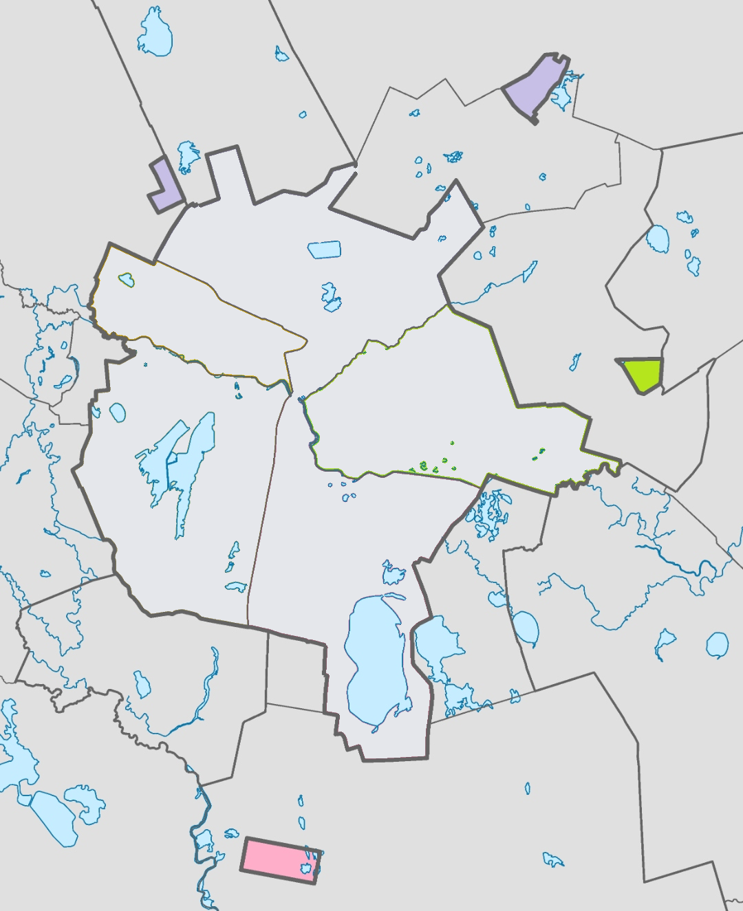
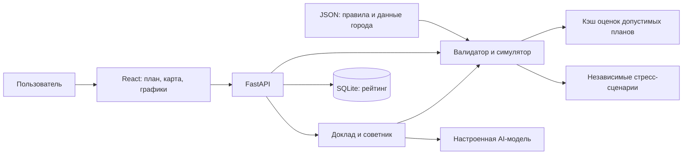

# Urban AI

**AI-симулятор управления городом: пять решений, ограниченный бюджет и измеримые последствия для жителей.**

## 1. Проблема и аудитория

Как распределить городской бюджет, если одновременно нужны школы, транспорт, безопасные улицы и надёжные коммунальные сети? Улучшение одного района может оставить другой без поддержки, а сильный план в обычных условиях — оказаться уязвимым к аварии или бурану.

«Urban AI» позволяет проверить такие решения в учебной модели Астаны. Проект рассчитан на участников хакатона, студентов и команды, изучающие городское управление. Пользователь получает **100 условных бюджетных единиц**, выбирает **ровно пять мер** и видит результат для города и каждого района.

## 2. Что реализовано

- **Короткий обзор и отдельные страницы:** город, мой план, результат, риски, стресс-тест, советник и рейтинг. План сохраняется при переходах между разделами.
- **Город в цифрах:** интерактивная карта пяти районов, сравнение районных баллов, тепловая карта десяти показателей, характеристики и натуральные единицы измерения.
- **Конструктор плана:** 14 мер в пяти направлениях; учёт стоимости, сроков и совместимости. Нельзя повторять меры, превышать бюджет или выбирать более двух мер одного направления. Сервер повторно проверяет ограничения.
- **Результат в контексте:** общий балл, изменения по районам, критические показатели, место среди **694 395 допустимых планов** и лучшая замена одной меры.
- **Риски и устойчивость:** доля реализуемого эффекта, риски исполнения и семь независимых стресс-сценариев. Дополнительные реакции оплачиваются из резерва.
- **AI-доклад:** объяснение результата, влияния на город, вклада мер и рисков для руководства.
- **AI-советник:** проверка альтернатив через инструменты симулятора, сравнение стоимости и устойчивости, применение предложенного плана.
- **Рейтинг команд:** сравнение по основному баллу или устойчивости. Для каждой команды хранится последняя отправка.
- **Работа без ИИ:** если ключ не задан или сервис недоступен, остаются расчётный доклад и проверенная ближайшая альтернатива. Пользователь получает понятное уведомление.

## 3. Как работает решение

1. В разделе **«Город»** пользователь изучает исходные показатели, карту и особенности районов.
2. В **«Мой план»** указывает команду, выбирает пять мер и районы для локальных решений. Стоимость и предварительный результат пересчитываются автоматически.
3. Нажимает **«Отправить сценарий»**. Сервер проверяет правила, рассчитывает результат и сохраняет его в рейтинге.
4. В **«Результате»** сравнивает показатели до и после, положение среди допустимых планов и оставшиеся проблемы.
5. В **«Стресс-тесте»** проверяет устойчивость к событиям и при наличии резерва выбирает реакции.
6. В **«Советнике»** получает доклад или проверенную альтернативу. Предложение можно применить, изучить и отправить как новый сценарий.

Во время подготовки ответа отображается индикатор загрузки. Технические сведения о провайдере и расходе токенов не показываются в пользовательском интерфейсе.



*Карта в интерфейсе помогает выбрать район и открыть его показатели.*

## 4. Технологии

| Компонент | Технологии |
| --- | --- |
| Интерфейс | TypeScript, React 18, Vite, CSS, SVG-карта |
| Сервер | Python 3.11+, FastAPI, Uvicorn, Pydantic |
| Расчёты | Python, NumPy для кэша пространства решений |
| Хранение рейтинга | SQLite |
| AI-интеграция | HTTPX; OpenAI Responses API для `gpt-6-sol`, OpenAI-совместимый Chat Completions API для других настроенных моделей |
| Модель в `.env.example` | `gpt-6-sol`; модель и адрес провайдера настраиваются через окружение |
| Проверки | pytest, независимый эталон расчёта, TypeScript-проверка при сборке |
| Запуск | Docker Compose либо локальные Python и Node.js |

`gpt-6-sol` вызывается с уровнем рассуждения `medium`. Для работы с этой моделью необходимы действующий ключ и доступ к ней в API-аккаунте. Модель объясняет результаты и предлагает варианты; **официальные баллы рассчитывает код симулятора**.

## 5. Архитектура



### Расчёт балла

Горизонт модели — восемь кварталов. Эффекты мер учитываются с долей `(8 − лаг) / 8`; дополнительные эффекты совместимых мер добавляются по правилам датасета. Значения показателей ограничены диапазоном 0–100. Районный балл — взвешенная сумма десяти показателей.

```text
D_avg = сумма (доля населения района × балл района)
N_crit = число показателей районов строго ниже 40
Score = 0.7 × D_avg + 0.3 × минимальный районный балл − N_crit
```

Так формула учитывает и общий уровень города, и положение слабейшего района. Неиспользованный бюджет не увеличивает основной балл. Он доступен для реакций на события.

### Проверка ответов ИИ

Сервер передаёт модели каталог, профили районов и рассчитанные факты. В докладе модель должна ссылаться на числовые факты через подстановки, например `{{score}}`. Неизвестные ссылки и числа, написанные вне разрешённых подстановок, отклоняются; после одной повторной попытки используется расчётный текст.

Советник получает исходный план и проверенную ближайшую альтернативу. Ему доступны до **шести вызовов** инструментов `validate` и `simulate`. Итоговый план сервер рассчитывает повторно. Проверка чисел не является гарантией правильности каждого качественного вывода модели.

### Структура репозитория

```text
frontend/src/            страницы, карта, графики и формы
backend/app/main.py      HTTP API
backend/app/engine/      правила, оценка планов, события и перебор
backend/app/ai/          провайдер, факты, промпты, доклад и советник
backend/app/storage.py   рейтинг в SQLite
backend/tests/          автоматические проверки
spec/                   датасет, эталон и контрольные сценарии
```

## 6. Установка и запуск

### Получение проекта

Нужны Git и доступ к репозиторию:

```bash
git clone https://github.com/BAITC-Hacks/hack-c4d4b101-skiter.git
cd hack-c4d4b101-skiter
git switch main
```

### Настройка ИИ — необязательно

В свежем клоне создайте локальный файл настроек:

```bash
cp .env.example .env
```

В `.env` заполните `LLM_API_KEY`. Адрес и модель задаются в `LLM_BASE_URL` и `LLM_MODEL`. Для OpenAI адрес — `https://api.openai.com/v1`. Не публикуйте ключ и не добавляйте его в `.env.example`. Файл `.env` исключён из Git и Docker-образа; Compose передаёт настройки серверу через окружение.

Без ключа приложение запускается и работает в расчётном режиме. В macOS скрытые файлы, включая `.env`, можно показать сочетанием **Cmd + Shift + .**

### Вариант A: Docker Compose

Установите и запустите Docker с поддержкой Compose. Из корня проекта:

```bash
docker compose up --build
```

Откройте [приложение на localhost:8501](http://localhost:8501). При первом запуске построение кэша оценок может занять дополнительное время. Данные рейтинга сохраняются в именованном Docker-томе.

Остановка:

```bash
docker compose down
```

### Вариант B: локально

Нужны **Python 3.11+** и **Node.js 20+**. Команды ниже — для macOS/Linux, из корня проекта:

```bash
python3 -m venv .venv
.venv/bin/pip install -r backend/requirements.txt
npm ci --prefix frontend
```

В первом терминале запустите сервер:

```bash
cd backend
../.venv/bin/uvicorn app.main:app --host 127.0.0.1 --port 8000
```

Во втором терминале, из корня проекта, запустите интерфейс:

```bash
npm run dev --prefix frontend -- --host 127.0.0.1 --port 8501
```

Откройте [приложение на 127.0.0.1:8501](http://127.0.0.1:8501). Оба процесса должны оставаться запущенными.

Сборка интерфейса:

```bash
npm run build --prefix frontend
```

## 7. Сценарий проверки для жюри

1. Запустите приложение и откройте **«Город»**. Исходный балл — **52.56**.
2. В **«Мой план»** задайте название команды, например «Жюри», и выберите:

| Мера | Район | Стоимость |
| --- | --- | ---: |
| M7 — Школа + детсад | Нура | 24 |
| M8 — Центр семейного здоровья / поликлиника | Нура | 20 |
| M10 — Освещение и камеры | Нура | 12 |
| M12 — Единая цифровая платформа обращений | Весь город | 14 |
| M5 — Перевод частного сектора на чистое топливо | Сарыарка | 25 |

3. Проверьте: стоимость **95**, резерв **5**, предварительный балл **56.54**.
4. Отправьте сценарий. Ожидаются **0 критических показателей**, **566-е место** среди 694 395 планов, результат лучше **99.92%** допустимых планов, разрыв до лучшего — **0.69**.
5. Откройте **«Стресс-тест»**. Без дополнительных реакций средний балл — **55.21**, худший — **53.58**. Основной результат остаётся **56.54**.
6. Выберите реакцию на **сбой городских ИТ-систем** стоимостью **5** и проведите стресс-тест. Балл этого сценария улучшится с **56.01** до **56.33**. Реакция на аварию теплосетей стоимостью **10** недоступна при резерве 5.
7. В **«Советнике»** запросите доклад и улучшение плана. Числа должны соответствовать расчёту; текст ИИ может меняться. Без доступа к ИИ приложение покажет расчётный вариант с пояснением.
8. Вернитесь в **«Мой план»**: выбранные решения сохранятся. Посмотрите команду в **«Рейтинге»**.

### Автоматические проверки

Из корня проекта после установки зависимостей:

```bash
.venv/bin/pytest -q
.venv/bin/python spec/reference_scoring.py
npm run build --prefix frontend
```

Эталон должен вывести `19/19 passed`. Проверки охватывают контрольные сценарии, бюджет и несовместимости, совпадение с эталоном на случайных допустимых планах, пространство решений, стресс-сценарии и защиту числовых ответов ИИ. Провайдер в автоматических AI-проверках подменяется; они не требуют ключа и не расходуют токены.

## 8. Данные и интеграции

- **Синтетический датасет:** `spec/city_dataset.json` — единственный источник правил, показателей, мер, совместимости и событий. Включает пять районов, десять показателей, 14 мер и семь событий. Это учебные данные, а не актуальная городская статистика; персональных данных нет.
- **Натуральные единицы:** расчётные баллы дополнены понятными величинами из датасета: время поездки, обеспеченность услугами, состояние сетей и другие показатели.
- **Карта:** локальный SVG на основе выгрузки слоя районов ГИС Е-Саулет. Он адаптирован к модели из пяти районов; обращение к ГИС при работе приложения не требуется. Источник геометрии указан в разделе ниже.
- **AI-провайдер:** OpenAI либо настроенный совместимый сервис. Ему передаются выбранный план и контекст синтетической модели; ключ хранится на сервере. Сетевой доступ требуется для AI-ответов.
- **SQLite:** хранит последнюю отправку каждой команды. Контрольные ответы `spec/test_cases.json` используются только проверками, приложение не подставляет их вместо расчёта.

Источник карты: [слой районов ГИС Е-Саулет](https://gis.esaulet.kz/server/rest/services/Hosted/raiony/FeatureServer/0), выгрузка от 23 сентября 2026 года. Исходная геометрия содержит шесть полигонов; Сарайшық объединён с Алматы для соответствия пятирайонной учебной модели. Карта не предназначена для юридического определения административных границ.

## 9. Соответствие задаче хакатона

| Что оценивает жюри | Где посмотреть |
| --- | --- |
| Работоспособность основного сценария | «Мой план» → «Результат»; контрольный пример выше |
| Обоснованность решений | Районные показатели, критические значения, стоимость и сроки |
| Применение ИИ | Доклад и советник с инструментами проверки кандидатов |
| Наглядность | Карта, тепловая карта, сравнение районов и стресс-графики |
| Воспроизводимость | Общий датасет, детерминированный расчёт, эталон и автоматические проверки |
| Устойчивость решения | Работа без AI-ключа и отдельная оценка городских событий |

## 10. Ограничения текущей версии

- Это учебная статическая модель. Она не предназначена для принятия реальных бюджетных решений и не прогнозирует экономику или поведение жителей.
- Сценарии событий независимы и не имеют вероятностей. Их средний балл — сравнительная характеристика устойчивости, а не математическое ожидание прогноза.
- Советник ограничен шестью вызовами инструментов и не гарантирует глобально оптимальный план. Качественные выводы ИИ требуют осмысленного прочтения.
- Нет регистрации, ролей, защиты названий команд и ограничения частоты запросов. SQLite и текущая конфигурация запуска рассчитаны на локальную демонстрацию; для публичного сервиса нужны контроль доступа, лимиты AI-запросов, HTTPS и производственная схема размещения.
- План сохраняется между разделами открытой вкладки, но сбрасывается при полной перезагрузке страницы. В рейтинге остаются отправленные результаты.
- Задержка и доступность AI-ответов зависят от провайдера, модели и настроек аккаунта. Расчётная часть работает независимо от него.

## 11. Демонстрационная версия

Публичная deployed-ссылка в репозитории пока не указана. После запуска по инструкции доступна [локальная демонстрация](http://localhost:8501/#home).

[Репозиторий проекта](https://github.com/BAITC-Hacks/hack-c4d4b101-skiter)
